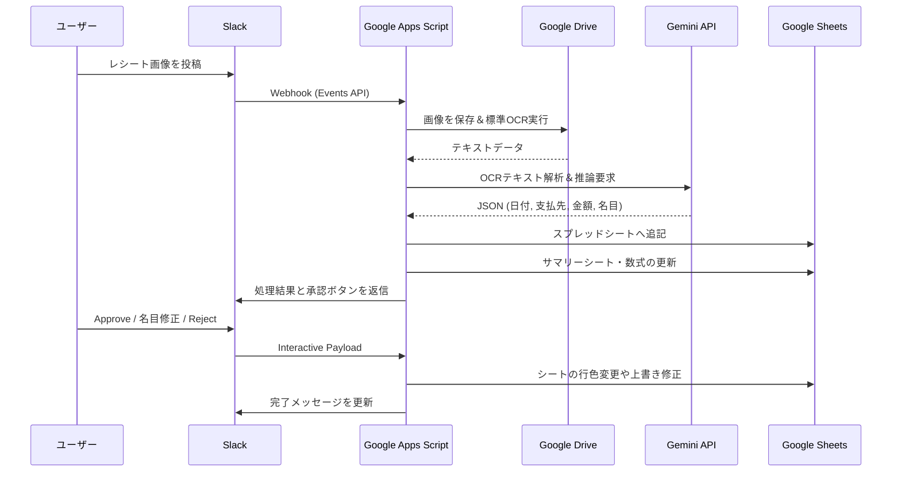

# 確定申告自動化システム (v1.0.1) 完成レポート

Slack、Google Drive、Google Sheetsを連携させた、個人の確定申告作業を大幅に自動化・効率化するシステムの開発が完了しました。

## 🚀 実装された主要機能

### 1. レシート画像からの全自動データ抽出 (OCR + AI)
- Slackの特定のチャンネル（`#領収書送付`等）にレシートの画像やPDFを投稿するだけで、自動的にGoogle Driveにファイルが保存されます。
- **[NEW!]** 保存先は「確定申告レシート」フォルダ内に自動で作成される、レシートの日付に基づいた「年-月」フォルダ（例：`2026-2`）に変更されました。
- Google DriveのOCR機能と最新のGemini AI (Flashモデル) を活用し、画像から以下の情報を高精度に抽出・推論します。
  - **日付**
  - **支払先（店舗名）**
  - **総額**
  - **経費のカテゴリ（名目）**

- 抽出されたデータは、指定されたGoogleスプレッドシートの該当年のシート（例：`2026`）へ自動的に最下段に追記されます。
- **[NEW!]** データ追加時、シート全体が「日付」で自動的に昇順にソート（並び替え）され、月別に見やすい状態が維持されます。
- **[NEW!]** シートに標準のフィルターが自動適用され、「2月分だけ表示する」といった絞り込みが可能です。
- 重複チェック機能により、すでに登録されている可能性のある領収書（日付、金額、店舗名が近似するもの）には警告フラグが立ちます。
- 証憑（領収書）の元画像へのGoogle Driveリンクも同時に記録され、後からすぐに原本を確認可能です。

### 3. 個人事業主（リモートワーク）向け「按分処理」の自動化
- 設定シートに定義された「名目」と「按分率」に基づき、自動で経費計上額（総額 × 按分率）を計算する数式を出力します。
- 今回のヒアリングに基づき、以下の初期プリセットを導入しました。
  - **地代家賃**: `30%` （仕事スペースの割合）
  - **水道光熱費**: `30%` （稼働時間をベースとした推計）
  - **通信費**: `80%` （スマホ/ネット常時利用）

### 4. 単一スプレッドシートでのリアルタイム集計（サマリー機能）
- データが追加されると同時に、「サマリー」シートが自動作成・更新されます。
- 年別・月別・カテゴリ別に、「経費対象」と「経費対象外」を分けてリアルタイムに集計。
- 新しい名目が設定シートに追加された場合は、次回のアップロード時にサマリーシートへ自動で行（枠）が追加拡張されるよう設計されています。

### 5. Slackへの対話型（Interactive）通知と承認フロー
- スプレッドシートへの記帳完了後、Slackに処理結果（抽出内容、推論された名目、計算された経費額）が通知されます。
- 通知には「Approve（承認）」と「Reject（修正/削除）」のボタンが付与されており、ユーザーがSlack上で最終確認を行えます。
- **[NEW!]** ソートなどでシートの行番号が変わっても正しく動作するよう、ボタン押下時は「証憑URL」をキーにして該当行を検索・更新する堅牢な仕様になっています。
- **推論された名目の修正**: Slackの通知ボタンから直接、他の名目（ドロップダウンリストから選択）に変更してスプレッドシートを上書き修正することが可能です。

---

## 🏗️ システム構成と実行フロー

## 📝 今後の運用について
* **名目の追加**: カスタムの経費科目が必要になった場合は、スプレッドシートの「設定」シート最下段に新しい名目と按分率を手動で追記するだけで、システム全体（AI推論、サマリー自動集計、Slackのドロップダウン等）に自動反映されます。
* **メンテナンス**: 今後追加の自動化（別のAIプロセスや新しいデータソースの統合など）が必要な場合は、既存のワークフローを拡張する形でいつでも対応可能です。
